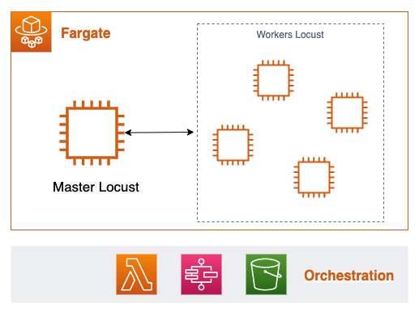
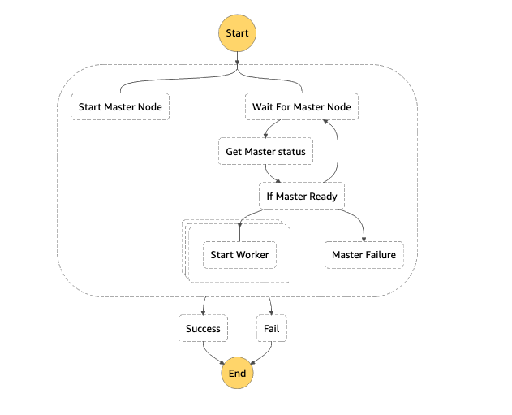

## Overall solution on AWS



**Fargate**: Serverless container platform. Deploy your dockers for Locust master and worker nodes.

**Step Function**: For orchestration. First, deploy the master node. Once ready, deploy the worker nodes.

**Lambda**: Python function to check the status of the master node and extract its IP address to allow worker nodes to connect.

**S3 bucket**: Staging area to fetch data required by your Locust tests


## Orchestration flow





## Setting up

See [here](./cloudformation/README.md) for setup.


## Sample Input

Sample input to trigger the Step :

```
{
  "JobDetails": {
    "ExecutionId": "ANY_RANDOM_ID",
    "ClusterName": "YOUR_FARGATE_CLUSTER",
    "TaskDefinition": "arn:aws:ecs:YOUR_REGION:YOUR_ACCOUNT_ID:task-definition/YOUR_TASK_NAME:1",
    "AwsRegion": "YOUR_REGION",
    "Subnets": [SUBNET_1, SUBNET_2],
    "SecurityGroups": [SECURITY_GROUP_TASKS_MUST_USE],
    "FamilyName": "YOUR_TASK_NAME",
    "MasterTaskName": "YOUR_TASK_NAME",
    "MasterCommand": [YOUR_MASTER_NODE_COMMAND]
  },
  "Jobs": [
    {
      "ExecutionId": "SAME_EXECUTION_ID",
      "ClusterName": "YOUR_FARGATE_CLUSTER",
      "TaskDefinition": "arn:aws:ecs:YOUR_REGION:YOUR_ACCOUNT_ID:task-definition/YOUR_TASK_NAME:1",
      "AwsRegion": "YOUR_REGION",
      "Subnets": [SUBNET_1, SUBNET_2],
      "SecurityGroups": [SECURITY_GROUP_TASKS_MUST_USE],
      "FamilyName": "YOUR_TASK_NAME",
      "WorkerTaskName": "YOUR_TASK_NAME",
      "WorkerCommand": [YOUR_WORKER_NODE_COMMAND]
    },
    {
      "ExecutionId": "SAME_EXECUTION_ID",
      "ClusterName": "YOUR_FARGATE_CLUSTER",
      "TaskDefinition": "arn:aws:ecs:YOUR_REGION:YOUR_ACCOUNT_ID:task-definition/YOUR_TASK_NAME:1",
      "AwsRegion": "YOUR_REGION",
      "Subnets": [SUBNET_1, SUBNET_2],
      "SecurityGroups": [SECURITY_GROUP_TASKS_MUST_USE],
      "FamilyName": "YOUR_TASK_NAME",
      "WorkerTaskName": "YOUR_TASK_NAME",
      "WorkerCommand": [YOUR_WORKER_NODE_COMMAND]
    }
  ]
}
```

Checkout the app example for a sample application using a custom Locust shape load.


## Sample application

See [here](./example/README.md) for a sample load testing.
